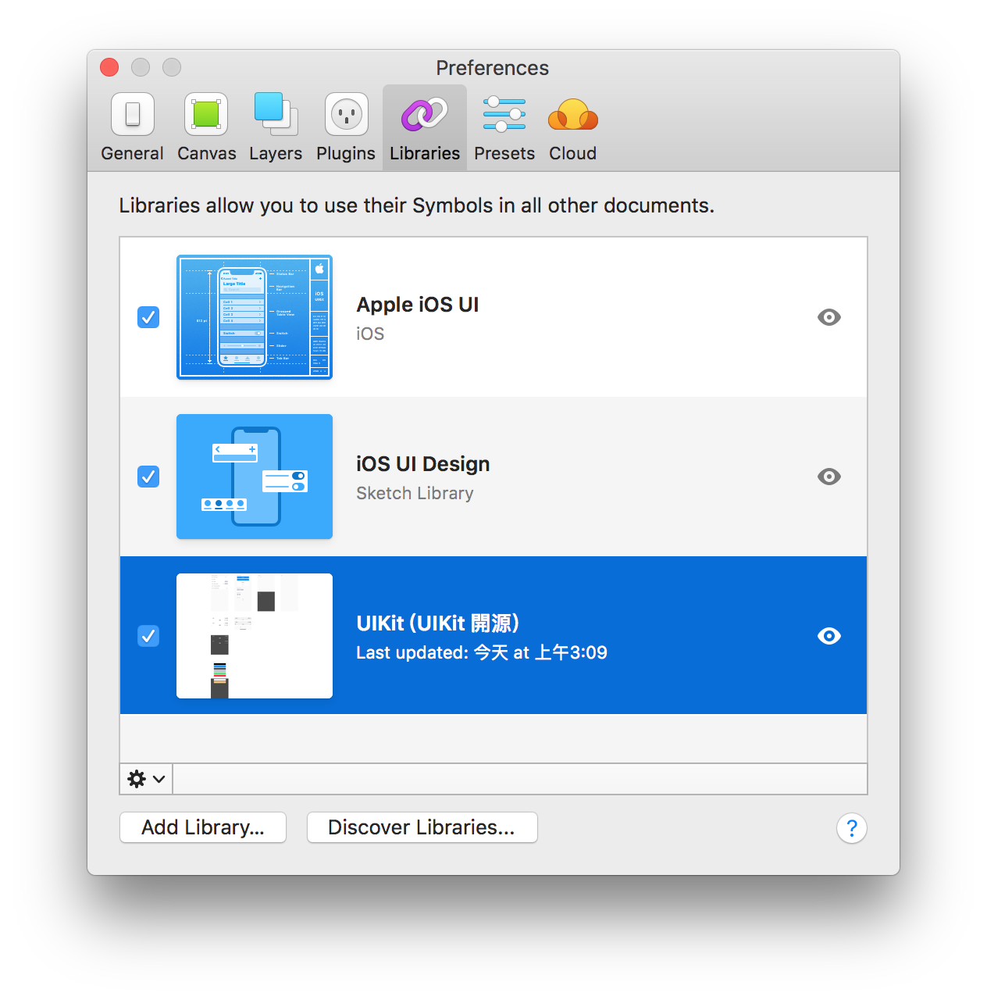
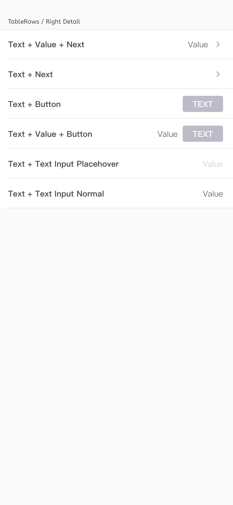
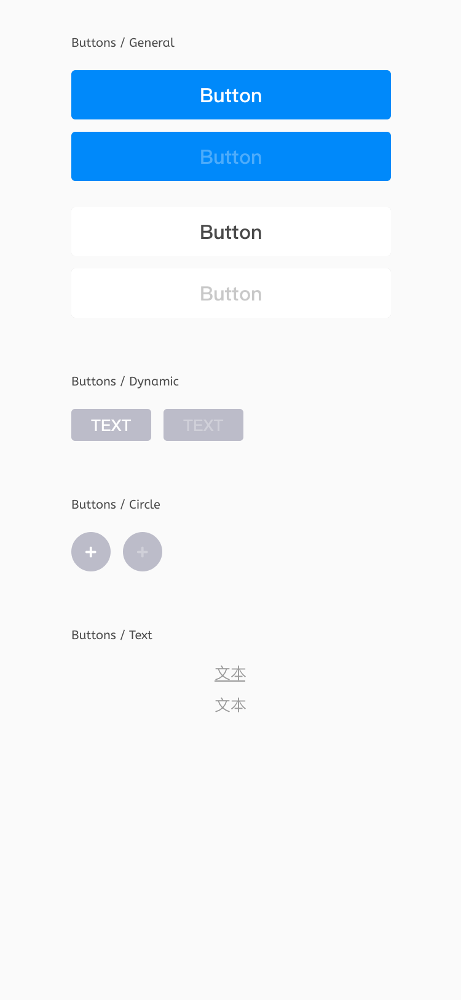
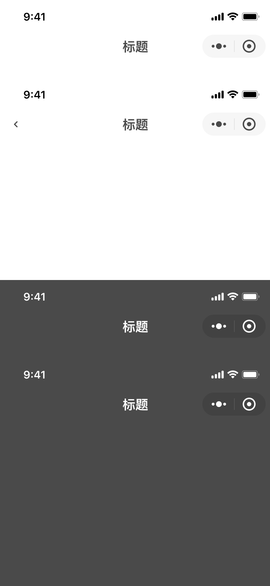

# Sam-WechatminiApp-UIKit
一個基於 WEPY 框架的 UIKit（Sam）

## Development Files

come soon

## Design Files

SketchFiles

### How to use

1. Download Sketch Files in "SketchFIles"

2. Add Libraries in Sketch.

# Specifications

### Table Rows

### Buttons

### Font icon base fontawesome 5

### Lines

### UIFace / Mini App

### UIFace / Web App

### Colors

